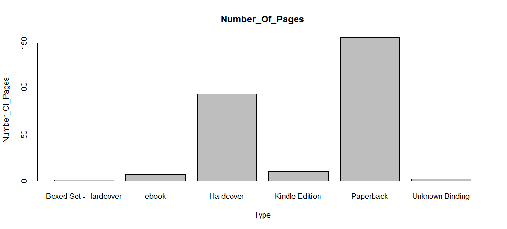

# R-Assignment 4
### Created by Athiti Khongsobsin (ID : 63130500128)

Choose Dataset : Top 270 Computer Science / Programing Books (Data from Thomas Konstantin, [Kaggle](https://www.kaggle.com/thomaskonstantin/top-270-rated-computer-science-programing-books)) >> [Using CSV](https://raw.githubusercontent.com/safesit23/INT214-Statistics/main/datasets/prog_book.csv)

## Outlines  
1. Explore the dataset
2. Learning function from Tidyverse
3. Transform data with dplyr and finding insight the data
4. Visualization with GGplot2
5. Data visualization with Power BI

## Part 1: Explore the dataset
```
# Library
library(dplyr)
library(stringr)
library(readr)
library(ggplot2)

# Dataset
progBook <- read.csv("prog_book.csv")
```

#### Check data ###
```
glimpse(progBook)
```
In this dataset has...
```
Rows: 271
Columns: 7
$ Rating          <dbl> 4.17, 4.01, 3.33, 3.97, 4.06, 3.84, 4.09, 4.15, 3.87, ~
$ Reviews         <chr> "3,829", "1,406", "0", "1,658", "1,325", "117", "5,938~
$ Book_title      <chr> "The Elements of Style", "The Information: A History, ~
$ Description     <chr> "This style manual offers practical advice on improvin~
$ Number_Of_Pages <int> 105, 527, 50, 393, 305, 288, 256, 368, 259, 128, 352, ~
$ Type            <chr> "Hardcover", "Hardcover", "Kindle Edition", "Hardcover~
$ Price           <dbl> 9.323529, 11.000000, 11.267647, 12.873529, 13.164706, ~
```


## Part 2: Learning function from Tidyverse
#### Function ```arrange()``` from Package [dplyr](https://dplyr.tidyverse.org/reference/arrange_all.html?q=arrange)...ใช้ในการเรียงข้อมูลใน Column ที่เรากำหนด โดย default นั้นจะเป็นการเรียงจากน้อยไปมาก แต่ถ้าใส่ ```desc()``` จะเรียงจากมากไปน้อย
```progBook %>% arrange(Number_Of_Pages)```
```
    Number_Of_Pages            Type     Price
1               464       Paperback  59.08235
2               460       Paperback  60.39118
3               192       Paperback  61.16765
4               318       Paperback  19.15294
5              1200       Paperback  36.61765
6               442       Paperback  27.85000
7                50  Kindle Edition  11.26765
8               286       Paperback  45.66471
9               462       Paperback  38.23529
10             1040       Hardcover 117.98824
11              388       Paperback  83.15000
12              487       Paperback  60.68235
13              475       Hardcover  77.05294
14              260       Paperback  42.26471
15              570       Paperback  50.51176
16              768       Hardcover  82.36765
17              176       Hardcover  32.84706
18              258       Paperback  25.28235
19              432       Paperback  19.24706
20              324       Paperback  45.33529
21              362       Hardcover 105.65000
22              250       Paperback  29.21176
23              368       Paperback  34.14118
24              375       Paperback  35.35882
25              528       Paperback  63.83529
26              242       Hardcover  17.62059
27              200       Paperback  15.32647
28              322       Paperback  42.55588
29              336       Hardcover  16.89118
30              421       Paperback  42.26471
31              312  Kindle Edition  31.48235
32              752       Hardcover 203.10882
33             1142       Hardcover  85.60588
34              703       Hardcover 139.43529
35              352       Hardcover  15.22941
36              281       Paperback  29.83529
37              350       Hardcover  41.24412
38              345       Hardcover  78.43529
39              208       Paperback  48.62941
40              448       Paperback  41.89118
41              328       Paperback  43.31471
42              700       Hardcover 119.20294
43              663       Hardcover 143.13824
44              256       Hardcover  35.84118
45              384  Kindle Edition  45.02941
46              851       Paperback  51.47353
47              355       Hardcover  59.52647
48              288       Paperback  14.18824
49              558       Paperback  24.51471
50              789       Hardcover 235.65000
...
```


#### Function ```filter()``` from Package [dplyr](https://dplyr.tidyverse.org/reference/filter_all.html?q=filter)...ใช้ในการคัดกรองข้อมูลที่เราต้องการ
```progBook %>% filter(Rating>4)```
```
    Rating Reviews
1     4.17   3,829
2     4.01   1,406
3     4.06   1,325
4     4.09   5,938
5     4.15   1,817
6     4.62       0
7     4.03     160
8     4.10   2,092
9     4.22      27
10    4.21      16
11    4.28   1,268
12    4.37       1
13    4.25      16
14    4.32      39
15    4.01     356
16    4.13      86
17    4.15     295
18    4.03      91
19    4.23     530
20    4.04      61
21    4.09     336
22    4.33       0
23    4.09       4
24    4.27   2,629
25    4.20     120
26    4.06      38
27    4.08       9
28    4.15      19
29    4.01   1,035
30    4.06     302
31    5.00       0
32    4.12     116
33    4.35     126
34    4.11      17
35    4.35      58
36    4.11     130
37    4.28       3
38    4.40     547
39    4.04      11
40    4.15     203
41    4.02      58
42    4.15      17
43    4.16     259
44    4.27     153
45    4.05       2
46    4.16      33
47    4.34      11
48    4.11      73
49    4.39       3
50    4.11     125
...
```
#### Function ```slice()``` from Package [dplyr](https://dplyr.tidyverse.org/articles/base.html?q=slice#slice-choose-rows-by-position)...ใช้ในเลือกเเถวตามตำเเหน่งที่เรากำหนด
```progBook %>% slice_head(n=10)```
```
   Number_Of_Pages           Type     Price
1              105      Hardcover  9.323529
2              527      Hardcover 11.000000
3               50 Kindle Edition 11.267647
4              393      Hardcover 12.873529
5              305 Kindle Edition 13.164706
6              288      Paperback 14.188235
7              256      Hardcover 14.232353
8              368      Hardcover 14.364706
9              259      Hardcover 14.502941
10             128      Paperback 14.641176
```

## Part 3: Transform data with dplyr and finding insight the data
#### 1. Top 5 Rating Books.
```
progBook %>% select(Book_title,Rating) %>% arrange(desc(Rating)) %>% slice_head(n=5)
```
```
Book_title                                                                                                    Rating
Your First App: Node.js                                                                                        5.00
The Art of Computer Programming, Volumes 1-4a Boxed Set                                                        4.77
Designing Data-Intensive Applications: The Big Ideas Behind Reliable, Scalable, and Maintainable Systems       4.72
Build Web Applications with Java: Learn every aspect to build web applications from scratch                    4.67
Fluent Python: Clear, Concise, and Effective Programming                                                       4.67
```
Explain
- ``select()`` ใช้ในการเลือก column ที่เราต้องการ
- ``arrange()`` ใช้ในการจัดเรียงข้อมูลที่เรากำหนด
- ``slice_head()`` ใช้ในการเลือกแค่ข้อมูลส่วนหัวตามจำนวนที่เราต้องการ
#### 2. Selling price per page
```
progBook %>% select(Number_Of_Pages, Price) %>% summarise(Number_Of_Pages/Price)
```
```
    Number_Of_Pages/Price
1               11.261830
2               47.909091
3                4.437484
4               30.527759
5               23.168007
6               20.298507
7               17.987187
8               25.618346
9               17.858447
10               8.742467
11              23.113171
12              23.113171
13              13.049319
14              20.915229
15              15.108313
16              17.917658
17              23.949686
18              18.038394
19              19.892042
20              31.457835
21              10.976963
22              13.733934
23              11.827924
24              21.534204
25              16.603194
26              22.444988
27              16.921937
28              15.957759
29              14.117647
30              15.210401
31              10.622036
32              18.201589
33              21.205624
34              19.069705
35               8.392809
36              17.480252
37               9.772936
38              14.919681
39               6.741835
40               7.710347
41              11.149675
42              17.652273
43               8.177215
44               7.127883
45              18.693294
46              14.221629
47              22.761848
48               5.662622
49              13.812626
50              10.204746
```
Explain
- ``summarise()`` ใช้ในการคำนวณค่าต่างๆตามที่เราต้องการ
#### 3. Average price of all books
```
progBook %>% select(Price) %>% summarise(mean(Price))
```
```
  mean(Price)
1    54.54186
```
Explain
- ``mean()`` ใช้ในการหาค่าเฉลี่ยนของ column ที่เรากำหนด
#### 4. Top 5 BAD Books (is not zero)
```
progBook %>% select(Book_title, Rating) %>% arrange(Rating) %>% filter(Rating != 0) %>% slice_head(n=5)
```
```
Book_title                                                                                 Rating
Advanced Game Programming: A Gamedev.Net Collection                                         3.00
Cross-Platform Game Programming (Game Development) (Charles River Media Game Development)   3.00
Lambda-Calculus, Combinators and Functional Programming                                     3.00
Game Programming Golden Rules                                                               3.20
Beginning Java 2                                                                            3.22
```
#### 5. find ALL ebook in the dataset.
```
progBook %>% filter(Type == "ebook")
```
```
Rating   Reviews       Book_title                                  Number_Of_Pages  Type    Price
5.00        0          Your First App: Node.js                           317        ebook  25.85588
4.16       33          Algorithms Unlocked                               237        ebook  34.35588
4.31      161          Learn You a Haskell for Great Good!               176        ebook  36.70000
4.15       18          From Mathematics to Generic Programming           320        ebook  41.40588
3.91       57          Effective Programming: More Than Writing Code     283        ebook  54.71765
4.45       88          Deep Learning                                     787        ebook  83.20294
4.02        3          Practical Foundations for Programming Languages   582        ebook  83.21176
```
#### 6. Find the thickest book
```
progBook %>% select(Book_title, Number_Of_Pages) %>% summarise(max(Number_Of_Pages))
```
```
Book_title                                                    Number_Of_Pages
The Art of Computer Programming, Volumes 1-4a Boxed Set            3168
```


## Part 4: Visualization with GGplot2
### 1.) BarGraph show type and how many pages for each type
```
bookNumber_Of_Pages <- table(progBook$'Type')
barplot(bookNumber_Of_Pages,main = 'Number_Of_Pages', ylab = 'Number_Of_Pages', xlab = 'Type')
```

### 2.) PlotGraph show Number_Of_Pages of Top 10 Computer Books
```
progBook_plot <- progBook %>% select(Number_Of_Pages,Book_title,Rating ) %>% arrange(desc(Rating)) %>% head(10) %>% 
ggplot(aes(x=Book_title ,y=Number_Of_Pages)) + geom_point()

progBook_plot + ggtitle("Number_Of_Pages of Top 10 Computer Books") + xlab("book name") + 
    ylab("Number_Of_Pages")
```


## Part 5 : Data visualization with Power BI
[PowerIB](https://app.powerbi.com/view?r=eyJrIjoiZTNlNGUyOTgtMzI1MS00NGY0LTk4NzYtOGNkNjAxZWMwNmI1IiwidCI6IjZmNDQzMmRjLTIwZDItNDQxZC1iMWRiLWFjMzM4MGJhNjMzZCIsImMiOjEwfQ%3D%3D)
