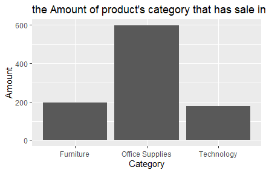

# R-Assignment 4

**Created by Hataiwan Mekvee (ID: 63130500160)**

Choose Dataset:

Superstore Sales Dataset (Data from Rohit Sahoo,[Kaggle](https://www.kaggle.com/rohitsahoo/sales-forecasting)) >> [Using CSV](https://raw.githubusercontent.com/safesit23/INT214-Statistics/main/datasets/superstore_sales.csv)


### Outlines
1. Explore the dataset
2. Learning function from Tidyverse
3. Transform data with dplyr and finding insight the data
4. Visualization with GGplot2

## Part 1: Explore the dataset

```
#library
library(readr)
library(dplyr)
library(ggplot2)
library(tidyr)

#explore dataset
sale <- read_csv("E:/Document/INT214/R project/train.csv")

View(sale)
```

In this dataset has 
```
Rows: 9,800
Columns: 18
$ `Row ID`        <dbl> 1, 2, 3, 4, 5, 6, 7, 8, 9, 10, 11, 12, 13, 14, 15, 16, 17, 18, 19, 20~
$ `Order ID`      <chr> "CA-2017-152156", "CA-2017-152156", "CA-2017-138688", "US-2016-108966~
$ `Order Date`    <chr> "08/11/2017", "08/11/2017", "12/06/2017", "11/10/2016", "11/10/2016",~
$ `Ship Date`     <chr> "11/11/2017", "11/11/2017", "16/06/2017", "18/10/2016", "18/10/2016",~
$ `Ship Mode`     <chr> "Second Class", "Second Class", "Second Class", "Standard Class", "St~
$ `Customer ID`   <chr> "CG-12520", "CG-12520", "DV-13045", "SO-20335", "SO-20335", "BH-11710~
$ `Customer Name` <chr> "Claire Gute", "Claire Gute", "Darrin Van Huff", "Sean O'Donnell", "S~
$ Segment         <chr> "Consumer", "Consumer", "Corporate", "Consumer", "Consumer", "Consume~
$ Country         <chr> "United States", "United States", "United States", "United States", "~
$ City            <chr> "Henderson", "Henderson", "Los Angeles", "Fort Lauderdale", "Fort Lau~
$ State           <chr> "Kentucky", "Kentucky", "California", "Florida", "Florida", "Californ~
$ `Postal Code`   <dbl> 42420, 42420, 90036, 33311, 33311, 90032, 90032, 90032, 90032, 90032,~
$ Region          <chr> "South", "South", "West", "South", "South", "West", "West", "West", "~
$ `Product ID`    <chr> "FUR-BO-10001798", "FUR-CH-10000454", "OFF-LA-10000240", "FUR-TA-1000~
$ Category        <chr> "Furniture", "Furniture", "Office Supplies", "Furniture", "Office Sup~
$ `Sub-Category`  <chr> "Bookcases", "Chairs", "Labels", "Tables", "Storage", "Furnishings", ~
$ `Product Name`  <chr> "Bush Somerset Collection Bookcase", "Hon Deluxe Fabric Upholstered S~
$ Sales           <dbl> 261.9600, 731.9400, 14.6200, 957.5775, 22.3680, 48.8600, 7.2800, 907.~
```


## Part 2: Learning function from Tidyverse

- Function `rename()` ใช้ในการเปลี่ยนชื่อ column

```
sale <- sale %>% rename(no = `Row ID`)
sale <- sale %>% rename(order_id = `Order ID`)
sale <- sale %>% rename(order_date = `Order Date`)
sale <- sale %>% rename(ship_date = `Ship Date`)
sale <- sale %>% rename(ship_mode = `Ship Mode`)
sale <- sale %>% rename(customer_id = `Customer ID`)
sale <- sale %>% rename(customer_name = `Customer Name`)
sale <- sale %>% rename(postal_code = `Postal Code`)
sale <- sale %>% rename(product_id = `Product ID`)
sale <- sale %>% rename(sub_category = `Sub-Category`)
sale <- sale %>% rename(product_name = `Product Name`)
```
Result:
```
Rows: 9,800
Columns: 18
$ no            <dbl> 1, 2, 3, 4, 5, 6, 7, 8, 9, 10, 11, 12, 13, 14, 15, 16, 17, 18, 19, 20, ~
$ order_id      <chr> "CA-2017-152156", "CA-2017-152156", "CA-2017-138688", "US-2016-108966",~
$ order_date    <chr> "08/11/2017", "08/11/2017", "12/06/2017", "11/10/2016", "11/10/2016", "~
$ ship_date     <chr> "11/11/2017", "11/11/2017", "16/06/2017", "18/10/2016", "18/10/2016", "~
$ ship_mode     <chr> "Second Class", "Second Class", "Second Class", "Standard Class", "Stan~
$ customer_id   <chr> "CG-12520", "CG-12520", "DV-13045", "SO-20335", "SO-20335", "BH-11710",~
$ customer_name <chr> "Claire Gute", "Claire Gute", "Darrin Van Huff", "Sean O'Donnell", "Sea~
$ Segment       <chr> "Consumer", "Consumer", "Corporate", "Consumer", "Consumer", "Consumer"~
$ Country       <chr> "United States", "United States", "United States", "United States", "Un~
$ City          <chr> "Henderson", "Henderson", "Los Angeles", "Fort Lauderdale", "Fort Laude~
$ State         <chr> "Kentucky", "Kentucky", "California", "Florida", "Florida", "California~
$ postal_code   <dbl> 42420, 42420, 90036, 33311, 33311, 90032, 90032, 90032, 90032, 90032, 9~
$ Region        <chr> "South", "South", "West", "South", "South", "West", "West", "West", "We~
$ product_id    <chr> "FUR-BO-10001798", "FUR-CH-10000454", "OFF-LA-10000240", "FUR-TA-100005~
$ Category      <chr> "Furniture", "Furniture", "Office Supplies", "Furniture", "Office Suppl~
$ sub_category  <chr> "Bookcases", "Chairs", "Labels", "Tables", "Storage", "Furnishings", "A~
$ product_name  <chr> "Bush Somerset Collection Bookcase", "Hon Deluxe Fabric Upholstered Sta~
$ Sales         <dbl> 261.9600, 731.9400, 14.6200, 957.5775, 22.3680, 48.8600, 7.2800, 907.15~
```

- Function `distinct()` ใช้ในการหาตัวไม่ซ้ำ ถ้าเจอตัวซ้ำตัดออก

```
sale %>% distinct(customer_name, .keep_all = FALSE) 
```
Result : 
```
# A tibble: 793 x 1
   customer_name     
   <chr>             
 1 Claire Gute       
 2 Darrin Van Huff   
 3 Sean O'Donnell    
 4 Brosina Hoffman   
 5 Andrew Allen      
 6 Irene Maddox      
 7 Harold Pawlan     
 8 Pete Kriz         
 9 Alejandro Grove   
10 Zuschuss Donatelli
# ... with 783 more rows
```

- Function `slice()` ใช้ในการตัดแถวๆนั้นออกมาแสดง

```
sale %>% slice(2:5)
```
Result :
```
# A tibble: 4 x 18
     no order_id order_date ship_date ship_mode customer_id customer_name Segment Country City 
  <dbl> <chr>    <chr>      <chr>     <chr>     <chr>       <chr>         <chr>   <chr>   <chr>
1     2 CA-2017~ 08/11/2017 11/11/20~ Second C~ CG-12520    Claire Gute   Consum~ United~ Hend~
2     3 CA-2017~ 12/06/2017 16/06/20~ Second C~ DV-13045    Darrin Van H~ Corpor~ United~ Los ~
3     4 US-2016~ 11/10/2016 18/10/20~ Standard~ SO-20335    Sean O'Donne~ Consum~ United~ Fort~
4     5 US-2016~ 11/10/2016 18/10/20~ Standard~ SO-20335    Sean O'Donne~ Consum~ United~ Fort~
# ... with 8 more variables: State <chr>, postal_code <dbl>, Region <chr>, product_id <chr>,
#   Category <chr>, sub_category <chr>, product_name <chr>, Sales <dbl>
```

- Function `top_n()` ใช้ในการหาท้อปหรือตัวที่สูงสุดของ column นั้นๆ

```
sale %>% top_n(5, no)
```
Result :

```
# A tibble: 5 x 18
     no order_id order_date ship_date ship_mode customer_id customer_name Segment Country City 
  <dbl> <chr>    <chr>      <chr>     <chr>     <chr>       <chr>         <chr>   <chr>   <chr>
1  9796 CA-2017~ 21/05/2017 28/05/20~ Standard~ SH-19975    Sally Hughsby Corpor~ United~ Chic~
2  9797 CA-2016~ 12/01/2016 17/01/20~ Standard~ CS-12490    Cindy Schnel~ Corpor~ United~ Tole~
3  9798 CA-2016~ 12/01/2016 17/01/20~ Standard~ CS-12490    Cindy Schnel~ Corpor~ United~ Tole~
4  9799 CA-2016~ 12/01/2016 17/01/20~ Standard~ CS-12490    Cindy Schnel~ Corpor~ United~ Tole~
5  9800 CA-2016~ 12/01/2016 17/01/20~ Standard~ CS-12490    Cindy Schnel~ Corpor~ United~ Tole~
# ... with 8 more variables: State <chr>, postal_code <dbl>, Region <chr>, product_id <chr>,
#   Category <chr>, sub_category <chr>, product_name <chr>, Sales <dbl>
> 
```

- Function `tally()` ใช้คล้ายๆการcount หรือนับจำนวนข้อมูลนั้นๆ

```
sale %>% group_by(sub_category) %>% tally()
```
Result :

```
# A tibble: 17 x 2
   sub_category     n
   <chr>        <int>
 1 Accessories    756
 2 Appliances     459
 3 Art            785
 4 Binders       1492
 5 Bookcases      226
 6 Chairs         607
 7 Copiers         66
 8 Envelopes      248
 9 Fasteners      214
10 Furnishings    931
11 Labels         357
12 Machines       115
13 Paper         1338
14 Phones         876
15 Storage        832
16 Supplies       184
17 Tables         314
```


## Part 3: Transform data with dplyr and finding insight the data

1. หา ชื่อลูกค้าและรหัสของคนนั้นๆแบบไม่ซ้ำกัน (เพื่อหาจำนวนของลูกค้าทั้งหมด)

```
sale %>% distinct(customer_name,customer_id, .keep_all = FALSE)
```

Result:

```
# A tibble: 793 x 2
   customer_id customer_name     
   <chr>       <chr>             
 1 CG-12520    Claire Gute       
 2 DV-13045    Darrin Van Huff   
 3 SO-20335    Sean O'Donnell    
 4 BH-11710    Brosina Hoffman   
 5 AA-10480    Andrew Allen      
 6 IM-15070    Irene Maddox      
 7 HP-14815    Harold Pawlan     
 8 PK-19075    Pete Kriz         
 9 AG-10270    Alejandro Grove   
10 ZD-21925    Zuschuss Donatelli
# ... with 783 more rows
```
Explain : 

- list 1


2. หาสินค้าที่มียอดขายสูงสุด 10 อันดับ โดยแสดงอันดับ ชื่อของลูกค้าที่ซื้อ ชื่อสินค้า และยอดขายนั้นๆ

```
sale %>% top_n(10, Sales) %>% select(no,customer_name,product_name,Sales)
```

Result:

```
# A tibble: 10 x 4
      no customer_name      product_name                                                  Sales
   <dbl> <chr>              <chr>                                                         <dbl>
 1  2624 Tom Ashbrook       "Canon imageCLASS 2200 Advanced Copier"                      11200.
 2  2698 Sean Miller        "Cisco TelePresence System EX90 Videoconferencing Unit"      22638.
 3  4099 Sanjit Chand       "Ibico EPK-21 Electric Binding System"                        9450.
 4  4191 Hunter Lopez       "Canon imageCLASS 2200 Advanced Copier"                      10500.
 5  4278 Bill Shonely       "3D Systems Cube Printer, 2nd Generation, Magenta"            9100.
 6  6426 Christopher Conant "Canon imageCLASS 2200 Advanced Copier"                       8400.
 7  6827 Tamara Chand       "Canon imageCLASS 2200 Advanced Copier"                      17500.
 8  8154 Raymond Buch       "Canon imageCLASS 2200 Advanced Copier"                      14000.
 9  8489 Sanjit Engle       "HP Designjet T520 Inkjet Large Format Printer - 24\" Color"  8750.
10  9040 Adrian Barton      "GBC Ibimaster 500 Manual ProClick Binding System"            9893.
```
Explain :

- list 1


3. หาสินค้าและรายะเอียดของสินค้าที่อยู่ในหมวดหมู่เทคโนโลยี และต้องส่งไปที่เมืองเท็กซัส

```
sale %>% filter(Category == "Technology" , State == "Texas") %>% select(product_id,product_name,sub_category,State)
```

Result :
```
# A tibble: 177 x 4
   product_id      product_name                                        sub_category State
   <chr>           <chr>                                               <chr>        <chr>
 1 TEC-PH-10004977 GE 30524EE4                                         Phones       Texas
 2 TEC-PH-10000486 Plantronics HL10 Handset Lifter                     Phones       Texas
 3 TEC-MA-10000822 Lexmark MX611dhe Monochrome Laser Printer           Machines     Texas
 4 TEC-PH-10003931 JBL Micro Wireless Portable Bluetooth Speaker       Phones       Texas
 5 TEC-AC-10001266 Memorex Micro Travel Drive 8 GB                     Accessories  Texas
 6 TEC-MA-10000822 Lexmark MX611dhe Monochrome Laser Printer           Machines     Texas
 7 TEC-MA-10003353 Xerox WorkCentre 6505DN Laser Multifunction Printer Machines     Texas
 8 TEC-PH-10001760 Bose SoundLink Bluetooth Speaker                    Phones       Texas
 9 TEC-AC-10000158 Sony 64GB Class 10 Micro SDHC R40 Memory Card       Accessories  Texas
10 TEC-PH-10000376 Square Credit Card Reader                           Phones       Texas
# ... with 167 more rows
```
Explain :

- list 1

4. หาสินค้าที่จะต้องส่งไปที่เมืองที่รหัสไปรษณีย์เลขมากกว่า 9400 และสินค้านั้นเป็นสินค้าที่มียอดขายมากกว่า 2,000

```
sale %>% filter(postal_code >= 94000 , Sales >= 2000 ) %>% select(City,postal_code,product_name,Sales)
```

Result :
```
# A tibble: 19 x 4
   City          postal_code product_name                                                 Sales
   <chr>               <dbl> <chr>                                                        <dbl>
 1 Seattle             98115 Canon PC940 Copier                                           3150.
 2 San Francisco       94122 High Speed Automatic Electric Letter Opener                  8188.
 3 Bellingham          98226 Hon 94000 Series Round Tables                                2666.
 4 Seattle             98105 Okidata MB491 Multifunction Printer                          2395.
 5 Seattle             98103 Ibico Ibimaster 300 Manual Binding System                    2061.
 6 San Francisco       94122 Bretford “Just In Time” Height-Adjustable Multi-Task Work ~  2004.
 7 San Francisco       94110 Cubify CubeX 3D Printer Double Head Print                    4800.
 8 Seattle             98103 Global Troy Executive Leather Low-Back Tilter                2405.
 9 Seattle             98115 Bevis Oval Conference Table, Walnut                          2349.
10 San Francisco       94109 High Speed Automatic Electric Letter Opener                  4913.
11 Seattle             98103 Fellowes PB300 Plastic Comb Binding Machine                  2794.
12 Seattle             98105 GBC DocuBind P400 Electric Binding System                    3266.
13 Seattle             98105 Global Troy Executive Leather Low-Back Tilter                2004.
14 Brentwood           94513 Sanyo 2.5 Cubic Foot Mid-Size Office Refrigerators           2518.
15 Seattle             98115 Canon imageCLASS 2200 Advanced Copier                       14000.
16 Seattle             98105 Hon 5100 Series Wood Tables                                  2037.
17 Sacramento          95823 Fellowes PB500 Electric Punch Plastic Comb Binding Machine~  5084.
18 San Francisco       94110 GBC ProClick 150 Presentation Binding System                 2022.
19 Seattle             98115 Fellowes PB500 Electric Punch Plastic Comb Binding Machine~  2034.
```
Explain :

- list 1

5. หาสินค้าที่ลูกค้าชื่อjoseph airdoเป็นคนสั่งซื้อ

```
sale %>% select(customer_name, product_name, Category) %>% filter(sale$customer_name =="Joseph Airdo")
```
Result :
```
# A tibble: 24 x 3
   customer_name product_name                                                    Category      
   <chr>         <chr>                                                           <chr>         
 1 Joseph Airdo  "Logitech B530 USB Headset - headset - Full size, Binaural"     Technology    
 2 Joseph Airdo  "Avery Durable Slant Ring Binders"                              Office Suppli~
 3 Joseph Airdo  "Universal Ultra Bright White Copier/Laser Paper, 8 1/2\" x 11~ Office Suppli~
 4 Joseph Airdo  "Clear Mylar Reinforcing Strips"                                Office Suppli~
 5 Joseph Airdo  "Martin Yale Chadless Opener Electric Letter Opener"            Office Suppli~
 6 Joseph Airdo  "Logitech Wireless Marathon Mouse M705"                         Technology    
 7 Joseph Airdo  "Xerox 1974"                                                    Office Suppli~
 8 Joseph Airdo  "Bevis Boat-Shaped Conference Table"                            Furniture     
 9 Joseph Airdo  "Staple envelope"                                               Office Suppli~
10 Joseph Airdo  "Speediset Carbonless Redi-Letter 7\" x 8 1/2\""                Office Suppli~
# ... with 14 more rows
```
Explain :

- list 1

6. อยากทราบจำนวนสินค้าที่ถูกขนส่งมาในแต่ละแบบ

```
sale %>% group_by(ship_mode) %>% count()
```

Result :
```
# A tibble: 4 x 2
# Groups:   ship_mode [4]
  ship_mode          n
  <chr>          <int>
1 First Class     1501
2 Same Day         538
3 Second Class    1902
4 Standard Class  5859
```
Explain :

- list 1


## Part 4: Visualization with GGplot2
### 1.) กราฟแสดงจำนวนของสินค้าในแต่ละหมวดหมู่ที่มีการสั่งซื้อในรัฐเท็กซัส
```
sale %>% filter(State=="Texas") %>% ggplot(aes(x= Category)) + geom_bar() + ggtitle("the Amount of product's category that has sale in Texas") + ylab("Amount")
```
Result:



### 2.) กราฟแสดงยอดขายของแต่ละรัฐในประเทศอเมริกา
```
sale %>% ggplot(aes(x=State , y=Sales)) + geom_point()
```
Result:


## tools : Power Bi

https://app.powerbi.com/view?r=eyJrIjoiYTQzNjQ0YzktNTczMC00YjQwLWI3MTEtNTQ0YzU1ZTBlYmY0IiwidCI6IjZmNDQzMmRjLTIwZDItNDQxZC1iMWRiLWFjMzM4MGJhNjMzZCIsImMiOjEwfQ%3D%3D

